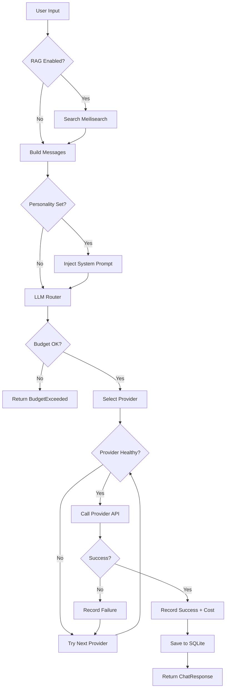
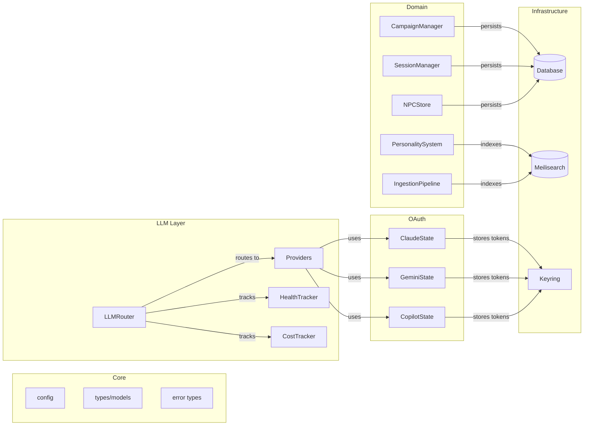

# TTTRPS Design-Language Extraction
## Reimplementation Blueprint (Language-Agnostic)

**Extraction Date:** 2026-02-02
**Source:** TTTRPS (TTRPG Assistant / Sidecar DM) v1.0.0
**Target Audience:** Senior engineering team rewriting this system in a different language

---

# Phase 0 — Orientation (Fast Pass)

## 0.1 Repository Map

| Area | Path(s) | Purpose | Criticality |
|------|---------|---------|-------------|
| **App Entry** | `src-tauri/src/main.rs` | Tauri app bootstrap, plugin init, state management | 🔴 Fatal |
| **Central State** | `src-tauri/src/commands/state.rs` | AppState struct (38 fields) - DI container | 🔴 Fatal |
| **Commands (IPC)** | `src-tauri/src/commands/` | 200+ Tauri command handlers across 21 modules | 🔴 Fatal |
| **LLM Router** | `src-tauri/src/core/llm/router/` | Multi-provider routing with failover | 🔴 Fatal |
| **Database** | `src-tauri/src/database/` | SQLite with extension trait pattern | 🔴 Fatal |
| **Search Engine** | `src-tauri/src/core/search/` | Meilisearch client + hybrid search | 🟠 Architectural |
| **Document Ingestion** | `src-tauri/src/ingestion/` | Kreuzberg PDF extraction + semantic chunking | 🟠 Architectural |
| **OAuth Layer** | `src-tauri/src/oauth/` | Claude/Gemini/Copilot token management | 🟠 Architectural |
| **Personality System** | `src-tauri/src/core/personality/` | 6-layer personality composition | 🟡 Significant |
| **Campaign/Session** | `src-tauri/src/core/campaign/`, `session_manager.rs` | Campaign lifecycle, combat tracking | 🟡 Significant |
| **Frontend Entry** | `frontend/src/lib.rs`, `app.rs` | Leptos WASM bootstrap + router | 🔴 Fatal |
| **Tauri Bindings** | `frontend/src/bindings/` | Type-safe IPC wrappers | 🔴 Fatal |
| **Services** | `frontend/src/services/` | Layout, Theme, Notification state | 🟠 Architectural |
| **Components** | `frontend/src/components/` | Atomic design hierarchy | 🟡 Significant |

## 0.2 Build & Runtime

- **Build**: `./build.sh dev|build|build --release` (Trunk for WASM, Cargo for backend)
- **Test**: `cd src-tauri && cargo test`
- **Run**: Desktop app via Tauri (auto-bundles Meilisearch sidecar)
- **Config surfaces**:
  - System keyring (API keys)
  - SQLite at `~/.local/share/ttrpg-assistant/ttrpg_assistant.db`
  - JSON config persisted via Tauri app data dir
  - Meilisearch data at `~/.local/share/ttrpg-assistant/meilisearch/`

## 0.3 The Philosophy

This system believes that:

1. **Desktop-first, single-user focus** — No distributed systems, no multi-tenancy. The user's machine is the source of truth.

2. **LLM providers are unreliable and expensive** — Circuit breakers, cost tracking, and automatic failover are first-class concerns, not afterthoughts.

3. **Documents are the knowledge base** — PDF/EPUB ingestion with semantic chunking creates the retrieval corpus for RAG. The system assumes users bring their own rulebooks.

4. **Personality is composable** — DM narration style, NPC voices, and setting tone are separate concerns that blend at runtime.

5. **The frontend is dumb, the backend is smart** — All business logic lives in Rust; the WASM frontend is purely presentational with signals driving reactivity.

---

# Phase 1 — Load-Bearing Walls 🔴

## 🔴 1. AppState as Central Dependency Container

**What it is**: A single `AppState` struct containing 38 fields that holds every manager, client, and configuration object. Passed to every Tauri command via `State<'_, AppState>`.

**Why it exists**: Tauri commands need access to shared state. Rather than scattered globals or complex DI, everything flows through one struct initialized at startup.

**What breaks if removed**:
- Every command handler loses access to databases, LLM providers, search clients
- Cross-cutting concerns (cost tracking, health monitoring) become impossible
- The single-threaded mental model dissolves into ad-hoc connections

**Reimplementation risk**:
- [ ] Can be swapped with effort
- [ ] Requires significant redesign
- [x] Defines the entire architecture

**Evidence**:
> Path: `src-tauri/src/commands/state.rs:43-81`
> Symbols: `AppState`, `init_defaults()`
> Snippet:
> ```rust
> pub struct AppState {
>     pub llm_client: RwLock<Option<LLMClient>>,
>     pub llm_config: RwLock<Option<LLMConfig>>,
>     pub llm_router: AsyncRwLock<LLMRouter>,
>     pub llm_manager: Arc<AsyncRwLock<LLMManager>>,
>     pub campaign_manager: CampaignManager,
>     pub session_manager: SessionManager,
>     pub database: Database,
>     pub search_client: Arc<SearchClient>,
>     pub claude: Arc<ClaudeState>,
>     pub gemini: Arc<GeminiState>,
>     pub copilot: Arc<CopilotState>,
>     // ... 25+ more fields
> }
> ```

---

## 🔴 2. LLM Router with Circuit Breaker + Cost Tracking

**What it is**: A routing layer that sits between commands and LLM providers, implementing automatic failover, health tracking, budget enforcement, and multiple routing strategies.

**Why it exists**: LLM APIs fail unpredictably (rate limits, outages, model deprecation). Users have cost constraints. The system must gracefully degrade rather than hard-fail.

**What breaks if removed**:
- No automatic failover when Claude goes down
- No cost visibility or budget enforcement
- Every command must implement its own retry/fallback logic
- Provider health becomes invisible

**Reimplementation risk**:
- [ ] Can be swapped with effort
- [ ] Requires significant redesign
- [x] Defines the entire architecture

**Evidence**:
> Path: `src-tauri/src/core/llm/router/mod.rs:62-79`
> Symbols: `LLMRouter`, `RoutingStrategy`, `CircuitState`
> Snippet:
> ```rust
> pub struct LLMRouter {
>     providers: HashMap<String, Arc<dyn LLMProvider>>,
>     provider_order: Vec<String>,
>     health_tracker: Arc<RwLock<HealthTracker>>,
>     cost_tracker: Arc<RwLock<CostTracker>>,
>     stats: Arc<RwLock<HashMap<String, ProviderStats>>>,
>     active_streams: Arc<RwLock<HashMap<String, StreamState>>>,
>     config: RouterConfig,
> }
> ```

> Path: `src-tauri/src/core/llm/router/mod.rs:424-512` (chat with fallback)
> ```rust
> pub async fn chat(&self, request: ChatRequest) -> Result<ChatResponse> {
>     if !self.cost_tracker.read().await.is_within_budget() {
>         return Err(LLMError::BudgetExceeded(...));
>     }
>     // Try providers in order with failover
>     for provider in providers_to_try {
>         if !self.is_provider_available(&id).await { continue; }
>         match timeout(self.config.request_timeout, provider.chat(request.clone())).await {
>             Ok(Ok(response)) => { self.record_success(...); return Ok(response); }
>             Ok(Err(e)) => { self.record_failure(...); if !enable_fallback { break; } }
>             Err(_) => { /* timeout */ }
>         }
>     }
> }
> ```

---

## 🔴 3. Meilisearch as Embedded Search Sidecar

**What it is**: Meilisearch runs as a managed subprocess (sidecar), auto-started by the app. It provides BM25 keyword search plus vector embeddings for hybrid semantic search.

**Why it exists**: TTRPG rulebooks are large (hundreds of pages). Users need to find relevant rules during play. Full-text search + semantic similarity outperforms either alone.

**What breaks if removed**:
- Document search becomes impossible or requires reimplementing a search engine
- RAG context retrieval fails
- The ingestion pipeline has no destination
- Vocabulary banks, archetype registries, personality templates lose their storage layer

**Reimplementation risk**:
- [ ] Can be swapped with effort
- [x] Requires significant redesign (but could use different search engine)
- [ ] Defines the entire architecture

**Evidence**:
> Path: `src-tauri/src/main.rs:65-86`
> Symbols: `sidecar_manager.start()`, `search_client.initialize_indexes()`
> Snippet:
> ```rust
> // Start Meilisearch Sidecar (checks existing/PATH/downloads as needed)
> let sm_clone = sidecar_manager.clone();
> tauri::async_runtime::spawn(async move {
>     if let Err(e) = sm_clone.start().await {
>         log::error!("Failed to start Meilisearch: {}", e);
>     }
> });
>
> // Initialize Meilisearch indexes after sidecar starts
> let sc = search_client.clone();
> tauri::async_runtime::spawn(async move {
>     if sc.wait_for_health(10).await {
>         if let Err(e) = sc.initialize_indexes().await { ... }
>     }
> });
> ```

---

## 🔴 4. Two-Phase Document Ingestion Pipeline

**What it is**: Documents (PDF, EPUB, DOCX) are processed in two phases: (1) Extract raw pages preserving layout, (2) Chunk semantically with TTRPG-aware splitting.

**Why it exists**: Page numbers matter for citations. Semantic boundaries (stat blocks, spell descriptions, chapter breaks) don't align with page breaks. Two phases preserve provenance while enabling intelligent retrieval.

**What breaks if removed**:
- Search results can't cite page numbers
- Chunking loses document structure awareness
- The "view in context" feature breaks
- OCR fallback for scanned PDFs becomes impossible

**Reimplementation risk**:
- [ ] Can be swapped with effort
- [x] Requires significant redesign
- [ ] Defines the entire architecture

**Evidence**:
> Path: `src-tauri/src/core/meilisearch_pipeline.rs`
> Symbols: `ingest_document_two_phase`, `SemanticChunker`
> Description: Phase 1 creates `<slug>-raw` index with per-page content. Phase 2 reads raw pages and creates semantic chunks in `<slug>` index with `source_pages` array for provenance tracking.

---

## 🔴 5. Tauri IPC as the Only Frontend-Backend Communication Channel

**What it is**: All communication between the Leptos WASM frontend and Rust backend happens via Tauri's `invoke()` mechanism. No HTTP APIs, no WebSockets for data.

**Why it exists**: Tauri provides secure, typed IPC with automatic serialization. The desktop app doesn't need network endpoints.

**What breaks if removed**:
- Frontend loses all backend access
- The 200+ commands become unreachable
- State synchronization fails
- Streaming (chat chunks) via Tauri events breaks

**Reimplementation risk**:
- [ ] Can be swapped with effort
- [ ] Requires significant redesign
- [x] Defines the entire architecture (for desktop deployment)

**Evidence**:
> Path: `frontend/src/bindings/core.rs:38-53`
> Symbols: `invoke()`, `invoke_raw()`
> Snippet:
> ```rust
> pub async fn invoke<A: Serialize, R: for<'de> Deserialize<'de>>(
>     cmd: &str,
>     args: &A,
> ) -> Result<R, String> {
>     let args_js = serde_wasm_bindgen::to_value(args)?;
>     let result = invoke_raw(cmd, args_js).await?;
>     serde_wasm_bindgen::from_value(result)
> }
> ```

---

# Phase 2 — Compression Points 🟠

## 🟠 Compression Point: LLMProvider Trait

**What it compresses**: All differences between Claude, Gemini, OpenAI, and Ollama APIs disappear behind a single trait.

**The abstraction** (language-agnostic):
```
INTERFACE LLMProvider:
    id() → String                                    // Provider identifier
    model() → String                                 // Current model name
    health_check() → async Bool                      // Is provider reachable?
    chat(ChatRequest) → async Result<ChatResponse>   // Synchronous chat
    stream_chat(ChatRequest) → async Receiver<ChatChunk>  // Streaming chat
    pricing() → Optional<ProviderPricing>            // Cost per token
    supports_streaming() → Bool
```

**Why this boundary exists here**: Providers have vastly different auth mechanisms (OAuth, API keys), message formats, and streaming protocols. The trait normalizes them for the router.

**What leaks through anyway**:
- Model-specific capabilities (vision, function calling) require out-of-band knowledge
- Token counting algorithms differ per provider
- Some providers don't support streaming at all

**Evidence**:
> Path: `src-tauri/src/core/llm/router/provider.rs`
> Symbols: `LLMProvider` trait, `OllamaProvider`, `ClaudeProvider`

---

## 🟠 Compression Point: Extension Traits on Database

**What it compresses**: Domain-specific database operations (campaigns, NPCs, sessions, chat messages) are organized as separate traits implemented on a single `Database` struct.

**The abstraction** (language-agnostic):
```
STRUCT Database { pool: ConnectionPool, path: FilePath }

TRAIT CampaignOps FOR Database:
    create_campaign(Campaign) → async Result
    get_campaign(id) → async Result<Optional<Campaign>>
    list_campaigns() → async Result<List<Campaign>>
    delete_campaign(id) → async Result

TRAIT SessionOps FOR Database:
    start_session(campaign_id) → async Result<Session>
    // ...

TRAIT NpcOps FOR Database:
    // ...
```

**Why this boundary exists here**: Single SQLite connection pool, but operations are logically grouped by domain. Extension traits provide organization without requiring separate database handles.

**What leaks through anyway**:
- Transaction coordination across traits requires manual handling
- No compile-time guarantee that a trait is implemented
- Testing requires the full Database struct, not just the trait

**Evidence**:
> Path: `src-tauri/src/database/campaigns.rs`, `sessions.rs`, `npcs.rs`
> Pattern: `impl CampaignOps for Database { ... }`

---

## 🟠 Compression Point: Leptos Signals + Context

**What it compresses**: All frontend state management collapses into reactive signals provided via context.

**The abstraction** (language-agnostic):
```
Signal<T>:
    get() → T                   // Read current value (reactive)
    set(T)                      // Write new value (triggers updates)
    update(fn(T) → T)           // Transform value

Context:
    provide<T>(value: T)        // Make value available to children
    use<T>() → T                // Retrieve value from ancestor
```

**Why this boundary exists here**: Leptos (like Solid.js) uses fine-grained reactivity. Signals are the primitive; context is the distribution mechanism. No Redux-style stores or prop drilling.

**What leaks through anyway**:
- Signal access rules (`.get()` reactive vs `.get_untracked()`)
- Closure capture semantics for async operations
- Effect cleanup responsibility

**Evidence**:
> Path: `frontend/src/services/layout_service.rs`
> Symbols: `RwSignal`, `provide_context()`, `use_context()`
> Snippet:
> ```rust
> pub struct LayoutState {
>     pub sidebar_visible: RwSignal<bool>,
>     pub sidebar_width: RwSignal<i32>,
>     pub active_view: RwSignal<ViewType>,
> }
> pub fn provide_layout_state() {
>     provide_context(LayoutState::new());
> }
> ```

---

# Phase 3 — Data & State (Language-Agnostic)

## 3.1 Core Entities ("The Nouns")

### Entity: Campaign

**Logical Schema**:
```
Campaign {
  id: UUID
  name: String
  description: Optional<String>
  game_system: String              // "dnd5e", "coc7e", "pathfinder2e"
  status: Enum(Active, Paused, Completed, Archived)
  theme: Optional<ThemeConfig>     // Visual theme weights
  created_at: Timestamp
  updated_at: Timestamp
  metadata: Map<String, Any>       // Custom fields
}
```

**Relationships**:
- 1:N with Session
- 1:N with NPC
- 1:N with Location
- 1:N with CampaignNote

**Invariants**:
- `game_system` is immutable after creation (changing systems breaks character/NPC data)
- Deleting a campaign cascades to all related sessions, NPCs, notes

**Evidence**:
> Path: `src-tauri/src/database/campaigns.rs`, `models/campaign.rs`

---

### Entity: Session

**Logical Schema**:
```
Session {
  id: UUID
  campaign_id: Ref<Campaign>
  session_number: Integer
  status: Enum(Planned, InProgress, Completed, Cancelled)
  started_at: Optional<Timestamp>
  ended_at: Optional<Timestamp>
  notes: Optional<String>
  combat_state: Optional<CombatState>  // Active combat tracking
  timeline: List<TimelineEvent>
}

CombatState {
  combatants: List<Combatant>
  current_turn: Integer
  round: Integer
  is_active: Bool
}

Combatant {
  id: UUID
  name: String
  initiative: Integer
  current_hp: Integer
  max_hp: Integer
  conditions: List<Condition>
  is_player: Bool
}
```

**Relationships**:
- N:1 with Campaign
- 1:N with TimelineEvent
- Contains embedded CombatState (not separate entity)

**Invariants**:
- Only one session per campaign can be `InProgress` at a time
- `session_number` auto-increments within campaign
- Ending a session clears active combat state

**Evidence**:
> Path: `src-tauri/src/core/session_manager.rs`

---

### Entity: NPC

**Logical Schema**:
```
NPC {
  id: UUID
  campaign_id: Optional<Ref<Campaign>>  // Null = global NPC
  name: String
  role: String                          // "merchant", "villain", "ally"
  personality_id: Optional<Ref<Personality>>
  archetype_id: Optional<Ref<Archetype>>
  backstory: Optional<String>
  stats: Optional<StatBlock>            // Game-system specific
  location_id: Optional<Ref<Location>>
  relationships: List<Relationship>     // Edges in relationship graph
  created_at: Timestamp
}
```

**Invariants**:
- Name must be non-empty
- If `personality_id` is set, dialogue generation uses that personality

---

### Entity: LibraryDocument

**Logical Schema**:
```
LibraryDocument {
  id: UUID                      // Deterministic from file path hash
  source_path: FilePath
  title: String
  content_type: Enum(Rulebook, Sourcebook, Adventure, Homebrew, Fiction, Other)
  game_system: Optional<String>
  status: Enum(Pending, Processing, Indexed, Failed)
  page_count: Integer
  chunk_count: Integer
  indexed_at: Optional<Timestamp>
  error_message: Optional<String>
  metadata: Map<String, Any>
}
```

**Invariants**:
- `id` is deterministic (same file always gets same ID)
- `status = Indexed` implies `chunk_count > 0`
- Re-ingesting overwrites existing chunks

---

## 3.2 State Management

| Question | Answer |
|----------|--------|
| Where does state live? | **SQLite** (campaigns, sessions, NPCs, chat history), **Meilisearch** (search indexes, archetypes, vocabularies), **Memory** (active session, combat state, LLM router) |
| How is it mutated? | **Direct writes** via SQLx queries (no ORM), **In-memory mutation** via Arc/RwLock |
| Source of truth hierarchy? | 🔴 **SQLite > Meilisearch > Memory**. DB is durable; Meilisearch can be rebuilt; memory is ephemeral |
| Consistency guarantees? | **Eventual** for search indexes (async ingestion), **Strong** for SQLite (WAL mode) |

## 3.3 Data Flow

### Document Ingestion Flow:
```
File Path
    ↓
[Hash to generate deterministic ID]
    ↓
[Create LibraryDocumentMetadata status=Processing]
    ↓
[Kreuzberg Extractor] ──→ OCR fallback if needed
    ↓
[Raw Pages] → Index to <slug>-raw (preserves page numbers)
    ↓
[Semantic Chunker] → TTRPG-aware splitting
    ↓
[Chunks with source_pages] → Index to <slug>
    ↓
[Update status=Indexed]
```

### Chat Flow:
```
User Message
    ↓
[Frontend: message_input signal]
    ↓
[Tauri invoke("chat", payload)]
    ↓
[Backend: chat command]
    ├─ [Optional: RAG search for context]
    ├─ [Personality prompt injection]
    └─ [LLMRouter.chat()]
        ├─ [Budget check]
        ├─ [Provider selection (strategy)]
        ├─ [Circuit breaker check]
        └─ [Provider.chat() with timeout]
            ↓
        [Record success/failure, cost]
    ↓
[ChatResponse] → Serialize
    ↓
[Frontend: messages signal update]
    ↓
[Persist to SQLite chat_messages table]
```

---

# Phase 4 — The Logic (Algorithms & Flows)

## 4.1 Primary Path ("The Spine")

The **primary unit of work** is a **chat message**:

- **Entry**: User types message, presses Enter
- **Transformation**:
  1. Optional RAG retrieval adds context
  2. Personality system prompt injected
  3. LLM router selects provider
  4. Provider API call with timeout
- **Persistence**: Response saved to SQLite `chat_messages`
- **Exit**: ChatResponse returned via IPC, rendered in UI



## 4.2 Critical Algorithms

### Algorithm: Provider Selection (Routing Strategy)
**Criticality**: 🔴

**Goal**: Select the best LLM provider for a request based on configured strategy.

**Pre-conditions**:
- At least one provider registered
- Budget not exceeded

**Pseudocode**:
```text
FUNCTION SelectProvider(request, strategy) → Optional<Provider>:
    // If request specifies a provider, try that first
    IF request.provider IS NOT NULL:
        provider = providers[request.provider]
        IF IsAvailable(provider):
            RETURN provider

    // Get all available providers (healthy + circuit allows)
    available = FILTER providers WHERE IsAvailable(p)

    IF available IS EMPTY:
        RETURN NULL

    SWITCH strategy:
        CASE Priority:
            RETURN available[0]  // First in registration order

        CASE CostOptimized:
            // 🔴 LOAD-BEARING: Selects cheapest based on historical avg cost
            RETURN MIN(available, BY avg_cost_per_request)

        CASE LatencyOptimized:
            RETURN MIN(available, BY avg_latency_ms)

        CASE RoundRobin:
            index = round_robin_counter MOD available.length
            round_robin_counter += 1
            RETURN available[index]

        CASE Random:
            RETURN RANDOM_CHOICE(available)

FUNCTION IsAvailable(provider_id) → Bool:
    health = health_tracker[provider_id]
    circuit = health.circuit_state

    IF circuit == Healthy:
        RETURN TRUE
    IF circuit == Degraded:
        RETURN TRUE  // Still allow requests
    IF circuit == Broken:
        // Check if enough time passed to attempt recovery
        IF NOW - health.last_failure > RECOVERY_TIMEOUT:
            circuit = HalfOpen  // Allow one probe request
            RETURN TRUE
        RETURN FALSE
```

**Edge Cases**:
- All providers broken: Return NoProvidersAvailable error
- Requested provider unavailable: Fall through to strategy
- Budget exceeded mid-request: Caught at router entry, not provider selection

**Evidence**:
> Path: `src-tauri/src/core/llm/router/mod.rs:276-349`

---

### Algorithm: Semantic Chunking
**Criticality**: 🟠

**Goal**: Split raw document text into semantically meaningful chunks for retrieval.

**Pre-conditions**:
- Raw pages extracted from document
- TTRPG vocabulary loaded (spell names, monster names, etc.)

**Pseudocode**:
```text
FUNCTION ChunkDocument(pages, config) → List<Chunk>:
    chunks = []
    current_chunk = ""
    current_pages = []

    FOR page IN pages:
        sections = DetectSections(page.text)  // Headers, stat blocks, etc.

        FOR section IN sections:
            // Check for TTRPG-specific boundaries
            IF IsTTRPGBoundary(section):
                // 🔴 LOAD-BEARING: Don't split stat blocks, spells, etc.
                IF current_chunk IS NOT EMPTY:
                    chunks.ADD(Chunk(current_chunk, current_pages))
                current_chunk = section.text
                current_pages = [page.number]
            ELSE:
                // Check size limits
                IF LENGTH(current_chunk + section.text) > config.max_chunk_size:
                    // Split at sentence boundary
                    split_point = FindSentenceBoundary(current_chunk, config.target_size)
                    chunks.ADD(Chunk(current_chunk[0:split_point], current_pages))
                    current_chunk = current_chunk[split_point:] + section.text
                ELSE:
                    current_chunk += section.text

                IF page.number NOT IN current_pages:
                    current_pages.ADD(page.number)

    // Flush remaining
    IF current_chunk IS NOT EMPTY:
        chunks.ADD(Chunk(current_chunk, current_pages))

    RETURN chunks

FUNCTION IsTTRPGBoundary(section) → Bool:
    // Patterns that should never be split
    patterns = [
        STAT_BLOCK_REGEX,      // "Armor Class 15, Hit Points 22..."
        SPELL_HEADER_REGEX,    // "Fireball. 3rd-level evocation..."
        ITEM_HEADER_REGEX,     // "Sword of Sharpness. Weapon (longsword)..."
    ]
    RETURN ANY(pattern.matches(section) FOR pattern IN patterns)
```

**Evidence**:
> Path: `src-tauri/src/ingestion/chunker.rs`
> Path: `src-tauri/src/ingestion/ttrpg/vocabulary/`

---

## 4.3 Failure Paths

### Failure: Meilisearch Sidecar Not Ready
**Criticality**: 🟠

**Trigger**: App starts, but Meilisearch binary takes >10s to become healthy.

**Propagation**:
1. `wait_for_health(10)` times out
2. Index initialization skipped
3. ArchetypeRegistry and VocabularyManager remain `None`
4. Search commands return "Search not available" errors
5. RAG context retrieval fails silently (empty context)

**Recovery**:
- Background task retries health check
- User can restart app
- Search eventually becomes available when Meilisearch starts

**User-visible impact**:
- Document search doesn't work immediately after launch
- Chat works but without RAG context

**Evidence**:
> Path: `src-tauri/src/main.rs:73-86`
> Warning: `"Meilisearch not ready after 10 seconds - indexes not initialized"`

---

### Failure: All LLM Providers Exhausted
**Criticality**: 🔴

**Trigger**: Every registered provider fails (rate limited, down, timeout).

**Propagation**:
1. Router tries each provider in strategy order
2. Each failure recorded to circuit breaker
3. After last provider fails, `LLMError::ApiError { status: 503 }` returned
4. Frontend shows error toast

**Recovery**:
- Circuit breakers auto-reset after timeout
- User can retry
- Auto-discovered Ollama provides local fallback

**User-visible impact**: Chat completely unusable until providers recover.

**Evidence**:
> Path: `src-tauri/src/core/llm/router/mod.rs:502-511`
> Error: `"All providers failed: [...]"`

---

## 4.4 Lifecycle (Startup → Shutdown)

```mermaid
flowchart TD
    subgraph Startup
        A[main()] --> B[env_logger::init]
        B --> C[Tauri Builder with 11 plugins]
        C --> D[setup callback]
        D --> E[AppState::init_defaults]
        E --> F[Database::new - BLOCKING, panics on failure]
        F --> G[spawn: Start Meilisearch sidecar]
        G --> H[spawn: Initialize search indexes]
        H --> I[spawn: Initialize archetype registry]
        I --> J[spawn: Configure LLM from persistence]
        J --> K[app.manage AppState]
    end

    K --> L[Main Event Loop]

    subgraph Shutdown
        L --> M[RunEvent::ExitRequested]
        M --> N[spawn: Stop LLM proxy]
        N --> O[Tauri exits, sidecar killed]
    end
```

**Critical Timing**:
- Database init is **synchronous blocking** — must succeed or app panics
- Meilisearch sidecar is **async fire-and-forget** — degraded mode if fails
- Archetype registry depends on Meilisearch — waits up to 15s
- LLM config restore depends on sidecar — retries up to 30s

---

# Phase 5 — Idiom Decoupling (Source → Target)

## 5.1 Idiom Translation Table

| Source Implementation | Logic Intent | Port Recommendation |
|-----------------------|--------------|---------------------|
| `RwLock<Option<T>>` for late-init | Lazy initialization after async setup | Factory pattern or Promise/Future that resolves once |
| `AsyncRwLock<T>` (tokio) | Concurrent reads, exclusive writes with async | Mutex + async/await or Actor model |
| `Arc<dyn Trait>` | Polymorphic shared ownership | Interface + reference counting or GC |
| `#[tauri::command]` attribute | Register function as IPC handler | Manual route registration or RPC framework |
| `State<'_, AppState>` extraction | DI via Tauri's extractor pattern | Constructor injection or service locator |
| `unwrap_or_else(\|poisoned\| poisoned.into_inner())` | Recover from panicked lock | Try-lock with exception handling |
| `spawn_local(async move { ... })` | Fire-and-forget async task in WASM | Promise without await, or Web Worker |
| `RwSignal<T>` (Leptos) | Fine-grained reactive primitive | Observable/Subject (RxJS) or Solid.js signals |
| Extension traits on Database | Organize methods without inheritance | Modules/namespaces or Repository classes |
| `serde` derive macros | Auto-generate serialization | JSON schema + codegen, or reflection |

**What NOT to port:**
- Rust lifetimes — Use GC or reference counting
- `#[cfg(test)]` conditional compilation — Use test frameworks' patterns
- Tauri plugin system — Use target platform's native extension mechanism
- Leptos `view!` macro — Use JSX, HTML templates, or target's reactive DSL

## 5.2 Hidden Dependencies ("Dark Matter")

| Dependency | Type | Risk |
|------------|------|------|
| SQLite WAL mode | Database | Must configure explicitly in other SQLite bindings |
| System keyring (keyring crate) | OS | Varies wildly: macOS Keychain, Windows Credential Manager, Linux Secret Service |
| `~/.local/share/` path convention | Filesystem | Linux-specific; macOS uses `~/Library/Application Support/`, Windows uses `AppData` |
| Meilisearch binary download | Network | Assumes HTTPS works, binary exists for target arch |
| `env_logger` initialization | Runtime | Must happen before any log calls |
| Tauri's `async_runtime` (tokio) | Concurrency | Multi-threaded by default; WASM uses single-threaded |
| WASM `spawn_local` | Browser | Only works in browser context with proper async runtime |

---

# Phase 6 — Interface Surface (Contracts)

## 6.1 Inputs

| Input Type | Format | Validation | Strictness |
|------------|--------|------------|------------|
| Tauri IPC | JSON (serde) | Type-checked at compile time | Strict (serde fails on unknown fields by default) |
| File paths | Platform strings | Existence checked at use | Loose (errors propagate) |
| LLM responses | JSON | Provider-specific parsing | Tolerant (fallback to raw string) |
| User text input | UTF-8 String | Length limits, sanitization | Configurable via ExtractionSettings |

## 6.2 Outputs

| Output Type | Success Format | Error Format | Notes |
|-------------|----------------|--------------|-------|
| Tauri commands | `Result<T, String>` → JSON | Error string | String errors for simplicity |
| Tauri events | `{ event, payload }` JSON | N/A | Fire-and-forget |
| SQLite queries | Rows as structs | `sqlx::Error` | Propagated up |
| Meilisearch | Search hits as JSON | `SearchError` | Custom error enum |

## 6.3 Protocol Semantics

### Tool/Endpoint Ontology

| Type | Examples | Characteristics |
|------|----------|-----------------|
| Pure queries | `get_campaign`, `list_npcs`, `search` | Stateless, cacheable, no side effects |
| Mutations | `create_campaign`, `delete_npc`, `ingest_document` | State-changing, should be idempotent where possible |
| Streaming | `stream_chat` → Tauri events | Long-lived, emits `chat-chunk` events |
| Background | `ingest_document_two_phase` | Returns immediately, status polled via `list_library_documents` |

### Latency Posture

- **Chat API calls**: 5-60 seconds (depends on model, prompt length)
- **Local search**: <100ms
- **Document ingestion**: Minutes (background, progress events)
- **Streaming**: First token target <2s, chunks every ~50ms

---

# Phase 7 — Internal Dependency Graph



**Load-bearing edges (🔴)**:
- `router → providers`: All LLM calls flow through here
- `* → database`: Primary persistence layer
- `* → meilisearch`: Search and archetype storage

**Potential cycles**: None detected. Clean DAG.

---

# Phase 8 — Design Language

## 8.1 Core Principles (Evidence-Required)

### Principle: "Errors as Values, Not Exceptions"
**Criticality**: 🟠

**Definition**: All fallible operations return `Result<T, E>`. No panics in production code paths except for truly unrecoverable states (database init failure).

**Evidence**:
> Path: `src-tauri/src/commands/state.rs:120-127`
> Snippet (graceful degradation):
> ```rust
> let claude = match ClaudeState::with_defaults() {
>     Ok(state) => Arc::new(state),
>     Err(e) => {
>         log::warn!("Failed to initialize Claude with default storage: {}. Using file storage.", e);
>         Arc::new(ClaudeState::new(ClaudeStorageBackend::File).expect(...))
>     }
> };
> ```

**Consequences**:
- Enables: Graceful degradation, explicit error handling at every level
- Forbids: `unwrap()` without justification, exception-based control flow

---

### Principle: "Single Source of Truth per Domain"
**Criticality**: 🔴

**Definition**: Each piece of state has exactly one authoritative location. Memory caches Meilisearch; SQLite is canonical for user data.

**Evidence**:
- Campaigns, sessions, NPCs → SQLite only
- Search indexes → Meilisearch, rebuildable from documents
- LLM config → Persisted to disk, loaded into memory at startup

**Consequences**:
- Enables: Clear cache invalidation, predictable data flow
- Forbids: Dual-write to multiple stores, ambiguous ownership

---

## 8.2 Patterns

**Popular patterns** (compress to table):

| Pattern | Where | Notes |
|---------|-------|-------|
| Repository (extension traits) | `database/*.rs` | `impl XxxOps for Database` |
| Circuit Breaker | `core/llm/health.rs` | Healthy → Degraded → Broken → HalfOpen |
| Provider abstraction | `core/llm/providers/` | `dyn LLMProvider` trait objects |
| Fire-and-forget async | `main.rs` spawn blocks | Sidecar init, archetype loading |
| Sidecar management | `core/sidecar_manager.rs` | Subprocess lifecycle for Meilisearch |

**Novel patterns**:

### Novel Pattern: Two-Phase Document Ingestion

**Intent**: Preserve document structure (page numbers) while enabling semantic retrieval (chunks).

**Shape** (language-agnostic):
```
Phase 1: Extract raw pages → Index as-is
Phase 2: Read raw pages → Chunk semantically → Index with provenance
```

**When to use**: Documents where citations matter (legal, academic, rulebooks).

**When NOT to use**: Ephemeral content, real-time streams.

**Failure modes**:
- Phase 1 fails: No raw index, Phase 2 can't run
- Phase 2 fails: Raw pages exist but not searchable by content

---

## 8.3 Invariants

| Category | Invariant | Enforcement | Criticality |
|----------|-----------|-------------|-------------|
| Data | Campaign IDs are UUIDs | Type system (`Uuid`) | 🟡 |
| Data | Document IDs deterministic from path | Hash function | 🟠 |
| Concurrency | Only one active session per campaign | Check in `start_session()` | 🟡 |
| Budget | Monthly/daily limits enforced | Router checks before every request | 🔴 |
| Startup | Database must init successfully | `block_on` + `panic!` | 🔴 |

---

# Phase 9 — Gotchas Register 🔴

## 9.1 Temporal Couplings

| Coupling | Description | Evidence |
|----------|-------------|----------|
| Database before AppState | Database::new() must complete before AppState is constructed | `main.rs:52-62` |
| Meilisearch before ArchetypeRegistry | Registry waits for health check | `main.rs:140-181` |
| LLM config after sidecar | Meilisearch chat client configured in retry loop | `main.rs:188-202` |
| Sidecar start → wait → init indexes | Health check gates index creation | `main.rs:73-86` |

## 9.2 Implicit Limits

| Limit | Value | Why | Evidence |
|-------|-------|-----|----------|
| Meilisearch health wait | 10-15 seconds | Avoid blocking startup too long | `main.rs:77, 141` |
| LLM config retry loop | 15 attempts × 2s = 30s | Sidecar may be slow to start | `main.rs:225-235` |
| SQLite max connections | 5 | Balance concurrency vs memory | `database/mod.rs` pool config |
| Chunk max size | Configurable (~4000 chars default) | LLM context window limits | `ingestion/chunker.rs` |
| Request timeout | Configurable (~60s default) | Prevent hung connections | `router/config.rs` |

## 9.3 Business Logic Quirks

| Quirk | Description | Evidence |
|-------|-------------|----------|
| Ollama auto-discovery | If no providers configured, tries localhost:11434 | `main.rs:238-269` |
| OAuth fallback chain | Keyring → File storage if keyring fails | `state.rs:120-147` |
| Poisoned lock recovery | Reads from poisoned RwLock instead of propagating | `commands/llm/chat.rs` |
| Deterministic document IDs | Same file path always produces same ID | `ingestion/hash.rs` |

---

# Phase 10 — Reimplementation Blueprint

## 10.1 What Would a Strong Team Keep?

If rewriting from scratch, preserve:

1. **LLMRouter architecture** — The abstraction, failover logic, and cost tracking are production-proven
2. **Two-phase ingestion** — The page provenance preservation is genuinely valuable
3. **AppState as DI container** — Simple, debuggable, no magic
4. **Extension trait pattern for DB** — Clean organization without ORM complexity
5. **Circuit breaker with recovery** — Essential for LLM reliability

## 10.2 Module Decomposition

| Module | Responsibility | Interface (Pseudocode) | Criticality |
|--------|---------------|------------------------|-------------|
| `llm_router` | Provider routing, failover, cost | `chat(Request) → Response`, `stream_chat(Request) → Stream` | 🔴 |
| `document_ingestion` | Extract, chunk, index | `ingest(Path) → DocumentId` | 🟠 |
| `search` | Query expansion, hybrid search | `search(Query) → List<Hit>` | 🟠 |
| `persistence` | SQLite operations | `save(Entity)`, `load(Id) → Entity` | 🔴 |
| `auth` | OAuth token management | `get_token(Provider) → Token`, `refresh(Token) → Token` | 🟠 |
| `personality` | Prompt composition | `get_system_prompt(Context) → String` | 🟡 |

## 10.3 Constraint Translation

| New Constraint | Current Approach | Required Adaptation |
|----------------|------------------|---------------------|
| Web deployment | Tauri desktop | Replace IPC with HTTP API, add auth |
| Multi-tenancy | Single-user SQLite | Database per tenant or row-level isolation |
| Serverless | Embedded Meilisearch | Managed Meilisearch service |
| Mobile | WASM + Tauri | React Native or Flutter, local-first sync |

## 10.4 Test Strategy

| What | How | Why Critical |
|------|-----|--------------|
| Router failover | Unit tests with mock providers | 🔴 Core reliability mechanism |
| Budget enforcement | Property tests with random usage | 🔴 Prevents runaway costs |
| Chunking boundaries | Golden tests against known documents | 🟠 TTRPG-specific splitting |
| OAuth token refresh | Integration tests against mock OAuth server | 🟠 Auth must work |
| Two-phase ingestion | End-to-end with test PDFs | 🟠 Provenance preservation |

## 10.5 Risk Register

| Risk | Severity | Mitigation |
|------|----------|------------|
| Meilisearch version mismatch | 🟠 | Pin version, test upgrades |
| LLM API changes | 🟠 | Version detection, adapter per version |
| Token storage security | 🔴 | Audit keyring access, consider encryption at rest |
| Sidecar process leaks | 🟡 | Process monitoring, cleanup on exit |
| Large document OOM | 🟠 | Streaming extraction, memory limits |

---

# Phase 11 — Unknowns

| Unknown | Why It Matters | Resolution |
|---------|----------------|------------|
| Exact Meilisearch schema | Index configuration undocumented | REQUIRES MANUAL REVIEW of `search/config.rs` |
| Voice provider implementations | Audio synthesis not deeply explored | REQUIRES MANUAL REVIEW of `core/voice/` |
| Combat condition tick timing | Start-of-turn vs end-of-turn semantics | REQUIRES MANUAL REVIEW of session_manager |
| Archetype resolution priority | When multiple archetypes match | REQUIRES MANUAL REVIEW of archetype/resolution |

---

# Self-Audit Checklist

- [x] 5 load-bearing walls with 🔴 ratings (AppState, LLMRouter, Meilisearch, Two-Phase Ingestion, Tauri IPC)
- [x] 3 compression points (LLMProvider trait, Extension traits, Leptos signals)
- [x] All data entities have logical schemas (Campaign, Session, NPC, LibraryDocument)
- [x] Idiom translation table populated (12 entries)
- [x] Gotchas register has temporal couplings (4 entries)
- [x] Lifecycle diagram present
- [x] Pseudocode uses no language-specific syntax
- [x] "What would a strong team keep?" answered (5 items)
- [x] All 🔴/🟠 ratings justified

---

# Final Questions

## 1. The Rewrite Killer

**What is the ONE thing that guarantees failure if misunderstood?**

The **LLM Router's circuit breaker + cost tracking integration**. If you rebuild the router without:
- Budget enforcement at the entry point (not per-provider)
- Proper failover ordering based on strategy
- Circuit state transitions (Healthy → Degraded → Broken → HalfOpen)
- Cost recording AFTER success confirmation

...you will either:
- Spend $10,000 on a runaway loop
- Hard-fail when one provider has an outage
- Oscillate between broken providers infinitely

## 2. The Portable Core

**If you could only preserve 20% of this codebase's logic, which 20% carries 80% of the value?**

1. `LLMRouter` + `LLMProvider` trait (~700 lines)
2. `SemanticChunker` with TTRPG patterns (~400 lines)
3. `Database` extension traits pattern (~300 lines total)
4. `AppState` initialization sequence (~200 lines)

These four modules handle: routing all LLM calls, preparing documents for search, persisting user data, and bootstrapping the app. Everything else is UI or domain-specific.

## 3. The Hidden Assumption

**What does this code assume about its environment that isn't documented anywhere?**

1. **Tokio multi-threaded runtime**: Many `spawn()` calls assume work-stealing scheduler. Single-threaded would deadlock.

2. **UTF-8 everywhere**: File paths, API responses, database strings all assumed UTF-8. Windows path edge cases may break.

3. **Network available at startup**: OAuth token refresh, Ollama discovery, Meilisearch health checks all assume connectivity. Offline-first would require significant changes.

4. **Local disk is fast and available**: No retry logic for disk I/O. NFS or slow USB storage could cause timeouts.

5. **User has ~1GB free disk**: Meilisearch data + SQLite + voice cache can grow significantly.
