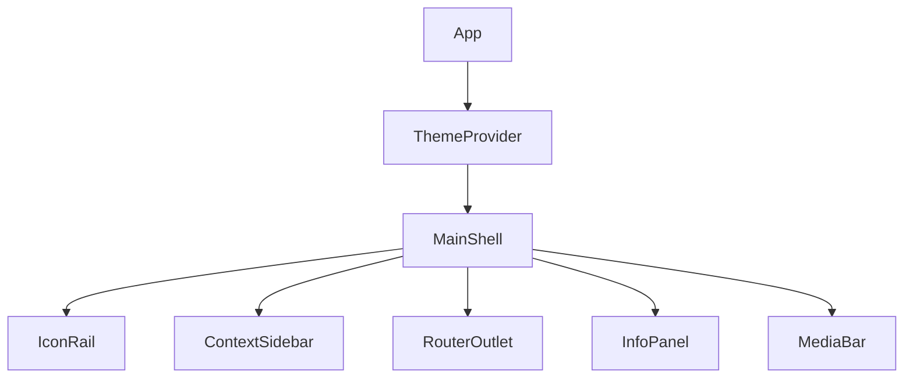

# Feature Parity Technical Design

> **Note**: This document is a technical implementation summary derived from the main
> design specification in `UXdesign/design.md`. For the full UX specification including
> visual mockups, component designs, and theme definitions, refer to the UXdesign directory.
> This document focuses on implementation details for the Dioxus/Rust frontend.

## Architecture Overview

### Frontend (Dioxus/WASM)
The application will move to a `Layout` based architecture where the root component is the **Main Shell**, managing the 5-panel grid.



## Data Structures

### Theme Engine (`src/services/theme.rs`)
To support **REQ-THEME-3 (Interpolation)**, we cannot rely solely on static CSS classes. We need a hybrid approach:
1.  **Static**: Base classes (`.theme-fantasy`) define defaults.
2.  **Dynamic**: An injected `style="..."` attribute overrides specific variables based on interpolation.

```rust
// Core structure for a theme definition
struct ThemeDefinition {
    colors: HashMap<String, Color>, // e.g. "bg-deep" -> Color::from_hex("#...")
    fonts: HashMap<String, String>,
    effects: HashMap<String, f32>,
}

pub struct ThemeState {
    pub weights: HashMap<ThemeType, f32>, // e.g. Fantasy: 0.5, Noir: 0.5
}

impl ThemeState {
    /// Linearly interpolates all defined variables and returns a CSS string
    /// e.g. "--bg-deep: #1a1a1a; --accent: #ff0000;"
    pub fn to_css_vars(&self) -> String { ... }
}
```

### Layout State (`src/services/layout.rs`)
Global signal to manage panel visibility.
```rust
pub struct LayoutState {
    pub sidebar_visible: bool,
    pub infopanel_visible: bool,
    pub active_view: ViewType, // Campaign, Library, Graph
}
```

## Component Hierarchy

### 1. `MainShell`
The CSS Grid container.
```css
display: grid;
grid-template-areas:
  "rail sidebar main info"
  "rail sidebar footer info";
grid-template-columns: 64px auto 1fr auto;
grid-template-rows: 1fr 56px;
```
*Note*: `auto` columns will be controlled by Dioxus state (0px when collapsed).

### 2. `MediaBar`
Persistent footer. Must subscribe to a global `AudioState` signal to update progress/now-playing even when navigating between pages.

### 3. `IconRail`
Dioxus `Link` components. Hovering triggers tooltips (using a new `Tooltip` component).

## Migration Strategy

1.  **Phase 1: Shell Implementation**: Create `MainShell` and move existing `Session` content into the "Main Content" slot.
2.  **Phase 2: Theme Engine**: Implement the interpolation logic in Rust. Replace the current `match system` string logic with the `ThemeState` system.
3.  **Phase 3: Component Refactor**: Break down `SessionList` and `NPCList` to fit the new `ContextSidebar` and `InfoPanel` slots respectively.
